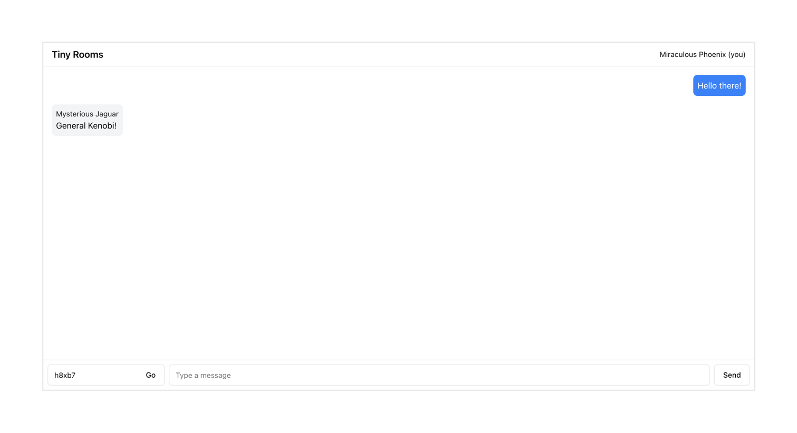
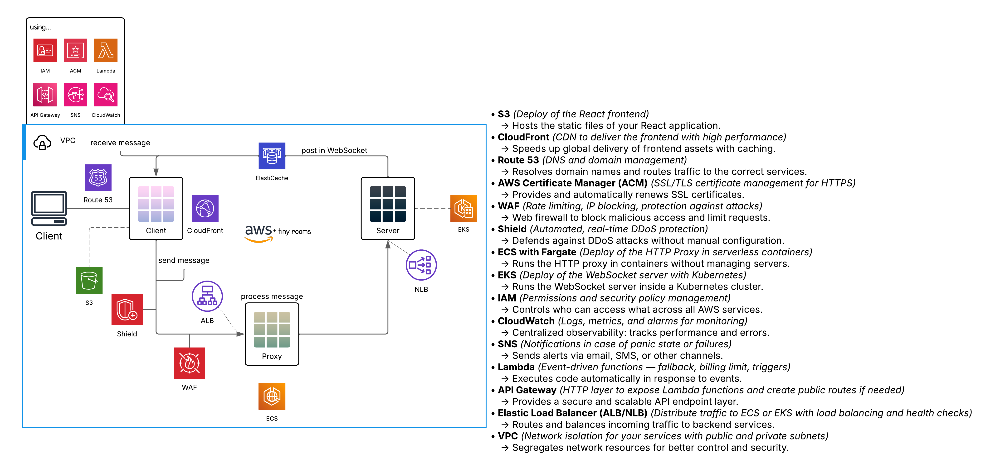

## About This Chat System

This is a real-time chat application that uses WebSockets for message delivery and an HTTP proxy to handle communication
between clients and the WebSocket server. Messages are sent via HTTP POST to a small proxy API, which then emits them to
the WebSocket server using `socket.io`. Each message has an identifier (`iid`), text content, sender name, and a room
ID (limited to 5 characters). The messages are broadcast only within the room the user joined, ensuring isolation
between conversations.

The client is built in React with Vite and is deployed to S3 with CDN using CloudFront. The WebSocket server runs inside
Amazon EKS for horizontal scaling, and the HTTP proxy runs in ECS with a public ALB. To handle message distribution at
scale, Valkey is used internally as a pub/sub adapter for the WebSocket layer. All traffic is encrypted, monitored by
CloudWatch, and protected via AWS WAF. The whole stack is designed to be minimal, fast, and secure.

